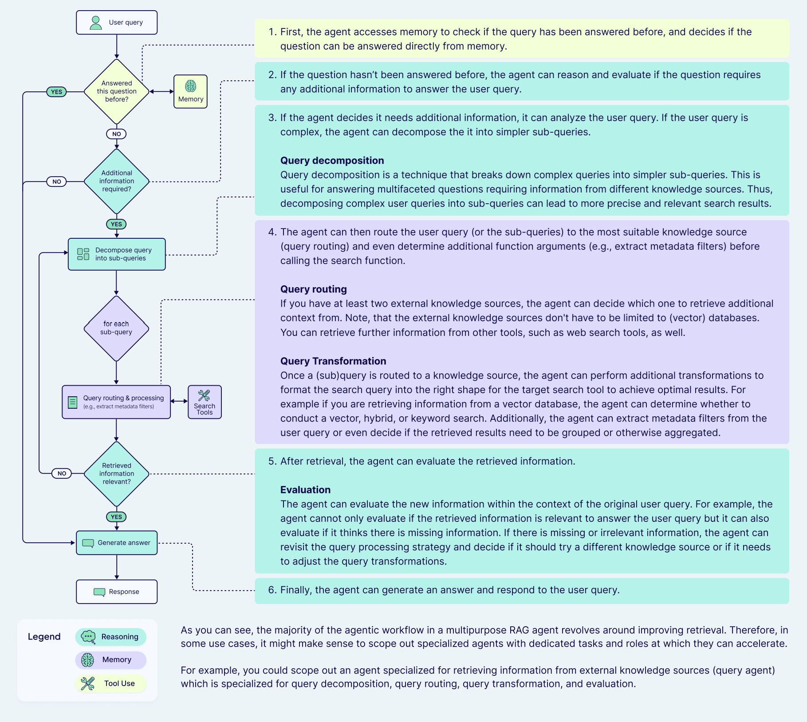

# Agentic Architecture

The Agentic Architecture is a modular system for building AI agents with clear separation of concerns between client and server components.



## Architecture Overview

The system is divided into two main components:

### Client-Side Components (`/client`)

#### Core Components

1. **`client.py`** - Main Entry Point
   - Orchestrates the entire agent workflow
   - Manages conversation flow and state
   - Connects to server for tool execution
   - Key functions:
     - `main()`: Processes user queries
     - `run_conversation()`: Handles multi-turn conversations

2. **`perception.py`** - Query Understanding
   - Extracts structured data from user queries
   - Uses Pydantic models for data validation
   - Key components:
     - `TravelSearch`: Main data model
     - `FlightSearch`: Flight-specific parameters
     - `HotelSearch`: Hotel-specific parameters
   - Uses LLM to parse natural language into structured format

3. **`decision_making.py`** - Action Planning
   - Analyzes extracted parameters
   - Decides which tools to use
   - Generates tool calls
   - Key functions:
     - `analyze_query()`: Initial query analysis
     - `get_llm_decision()`: Tool selection and planning

4. **`action_layer.py`** - Tool Execution
   - Executes tool calls from decision layer
   - Processes tool results
   - Formats responses
   - Key functions:
     - `execute_actions()`: Runs tools and processes results
     - `process_tool_calls()`: Handles individual tool calls

5. **`memory.py`** - Conversation Management
   - Stores and retrieves conversation history
   - Handles message persistence
   - Key features:
     - JSON-based storage
     - Message type handling
     - Conversation ID management

6. **`llm_provider.py`** - LLM Integration
   - Abstracts LLM interactions
   - Handles model configuration
   - Key features:
     - Multiple model support
     - Temperature control
     - Message formatting

7. **`ssl_helper.py`** - Security
   - Handles SSL verification
   - Manages secure connections

#### Testing Components

- **`test_client.py`** - Client testing
- **`test_llm.py`** - LLM functionality testing
- **`example_llm_usage.py`** - LLM usage examples

### Server-Side Components (`/server`)

1. **`server.py`** - Main Server
   - Handles client connections
   - Manages tool execution
   - Key features:
     - Async communication
     - Tool registration
     - Error handling

2. **`tools.py`** - Tool Implementation
   - Contains all available tools
   - Key tools:
     - Flight search
     - Hotel search
     - Weather information
     - Location services
   - Each tool is implemented as a class with:
     - Input validation
     - Error handling
     - Result formatting

3. **`server_generic.py`** - Generic Server
   - Base server implementation
   - Tool registration framework

4. **`test_tools.py`** - Tool Testing
   - Unit tests for tools
   - Integration tests

## Client-Server Communication

The client and server communicate through a custom protocol:

1. **Connection Setup**
   ```python
   # In client.py
   server_params = StdioServerParameters(command="python", args=["server/server.py"])
   async with stdio_client(server_params) as (read, write):
       async with ClientSession(read, write) as session:
           await session.initialize()
   ```

2. **Tool Execution Flow**
   - Client sends tool call request
   - Server receives and validates request
   - Server executes tool
   - Results are sent back to client
   - Client processes and formats results

3. **Error Handling**
   - SSL verification (ssl_helper.py)
   - Connection retries
   - Tool execution errors
   - Result validation

## Data Flow

1. **User Query → Client**
   ```python
   # client.py
   response, messages = await main(query, conversation_memory)
   ```

2. **Client → Perception**
   ```python
   # perception.py
   result = perception_chain.invoke({"user_query": query, "chat_history": chat_history})
   ```

3. **Perception → Decision Making**
   ```python
   # decision_making.py
   response, messages = await get_llm_decision(session, query, explanation, tools)
   ```

4. **Decision Making → Action Layer**
   ```python
   # action_layer.py
   response, messages = await execute_actions(response, messages, tools)
   ```

5. **Action Layer → Server**
   ```python
   # server.py
   tool_messages = await process_tool_calls(response.tool_calls, tools)
   ```

6. **Server → Tools**
   ```python
   # tools.py
   result = await tool.execute(params)
   ```

## Testing

The system includes comprehensive testing:

1. **Client Tests**
   - Conversation flow
   - Memory management
   - LLM integration

2. **Server Tests**
   - Tool functionality
   - Error handling
   - Connection management

3. **Integration Tests**
   - End-to-end workflows
   - Error scenarios
   - Performance testing

## Usage Example

```python
# Initialize conversation
conversation_memory = ConversationMemory()

# Process query
query = "Find flights from NYC to LA for next week"
response, messages = await main(query, conversation_memory)

# Handle response
print_message_chain(messages)
```

## Example Execution

Here's an example of the system processing multiple travel-related queries:

```
Starting conversation with ID: 9ec93bf7-3ea8-46ce-8c76-58bb97340f9a

==================================================
QUERY 1: I want to search for flights from New York to Los Angeles on 2025-05-01 with return on 2025-05-05
==================================================

Processing query through perception chain...
The perception result is: {
  "search_type": "flight",
  "currency": "USD",
  "start_date": "2025-05-01",
  "end_date": "2025-05-05",
  "flight": {
    "departure_id": "JFK",
    "arrival_id": "LAX"
  },
  "hotel": null,
  "enhanced_query": "Search for flights from New York (JFK) to Los Angeles (LAX) departing on 2025-05-01 and returning on 2025-05-05."
}

TOP FLIGHT OPTIONS FROM JFK TO LAX
Date: 2025-05-01 - 2025-05-05
Lowest Price: $571 (High price level)
Typical Price Range: $190 - $380

Flight Option 1:
  Price: $571
  Duration: 6h 11m (371 minutes)
  Airline: Frontier
  From: John F. Kennedy International Airport at 2025-05-01 11:30
  To: Los Angeles International Airport at 2025-05-01 14:41
  Carbon Emissions: 240 kg (33% less than average)

Flight Option 2:
  Price: $759
  Duration: 6h 15m (375 minutes)
  Airline: Delta
  From: John F. Kennedy International Airport at 2025-05-01 15:00
  To: Los Angeles International Airport at 2025-05-01 18:15
  Carbon Emissions: 248 kg (31% less than average)

Flight Option 3:
  Price: $759
  Duration: 6h 17m (377 minutes)
  Airline: American
  From: John F. Kennedy International Airport at 2025-05-01 15:25
  To: Los Angeles International Airport at 2025-05-01 18:42
  Carbon Emissions: 543 kg (51% more than average)

Flight Option 4:
  Price: $759
  Duration: 6h 27m (387 minutes)
  Airline: JetBlue
  From: John F. Kennedy International Airport at 2025-05-01 15:30
  To: Los Angeles International Airport at 2025-05-01 18:57
  Carbon Emissions: 404 kg (13% more than average)

==================================================
QUERY 2: What about booking a hotel for the same dates and same destination?
==================================================

Processing query through perception chain...
The perception result is: {
  "search_type": "hotel",
  "currency": "USD",
  "start_date": "2025-05-01",
  "end_date": "2025-05-05",
  "flight": null,
  "hotel": {
    "location": "Los Angeles",
    "adults": 1
  },
  "enhanced_query": "Search for a hotel in Los Angeles for 1 adult, with check-in on 2025-05-01 and check-out on 2025-05-05."
}

TOP ACCOMMODATIONS IN LOS ANGELES
Dates: 2025-05-01 to 2025-05-05 | Adults: 1

1. Cozy Studio for 2 in LA! Minutes to Downtown! [Vacation rental]
   Coordinates: 34.06098937988281, -118.27307891845703
   Website: https://www.expedia.com/Hotel.h114487973.Hotel-Information
   Price: $105 (Base: $105)
   Free Amenities: Free Wi-Fi
   Airport: Los Angeles International Airport (Taxi, 35 min)
   Dining: El Palacio Chapin Restaurant (Walking, 5 min)
   Nearby: Alvarado / Maryland (Walking, 5 min)

2. Freehand Los Angeles [Hotel, 4-Star]
   Trendy dorms & rooms in a funky lodging with dining & breakfast, plus a rooftop pool & bar.
   Coordinates: 34.044755099999996, -118.25645559999998
   Website: https://freehandhotels.com/los-angeles
   Check-in: 3:00 PM | Check-out: 12:00 PM
   Price: $58 (Base: $50)
   Rating: 4.1/5 (2994 reviews) | Location: 4.9/5
   Key Amenities: Outdoor pool, Fitness centre, Bar, Restaurant
   Free Amenities: Free Wi-Fi
   Paid Amenities: Breakfast ($)
   Airport: Los Angeles International Airport (Taxi, 29 min)
   Nearby: The Broad (Taxi, 7 min), Olive / 8th (Walking, 1 min)

[Additional hotel options...]

==================================================
QUERY 3: What is the capital of France?
==================================================

Query doesn't appear to be travel-related, skipping perception analysis
The capital of France is Paris.

==================================================
QUERY 4: I want to book hotel in New York for 2 nights starting on 2025-05-01 to 2025-05-05 for 2 adults
==================================================

Processing query through perception chain...
The perception result is: {
  "search_type": "hotel",
  "currency": "USD",
  "start_date": "2025-05-01",
  "end_date": "2025-05-03",
  "flight": null,
  "hotel": {
    "location": "New York",
    "adults": 2
  },
  "enhanced_query": "I want to book a hotel in New York for 2 nights starting on 2025-05-01 for 2 adults."
}

TOP ACCOMMODATIONS IN NEW YORK
Dates: 2025-05-01 to 2025-05-03 | Adults: 2

1. Charming spacious garden level apt [Vacation rental]
   Coordinates: 40.641387939453125, -73.95271301269531
   Website: https://thebestfurnished.com/product/charming-spacious-garden-level-apt/
   Check-in: 4:00 PM | Check-out: 10:00 AM
   Price: $235 (Base: $235)
   Rating: 4.6/5 (32 reviews) | Location: 3.2/5
   Free Amenities: Free Wi-Fi
   Airport: John F. Kennedy International Airport (Taxi, 40 min)
   Nearby: Newkirk Av-Little Haiti (Walking, 10 min), Gobo (Walking, 5 min)

2. Best Western Queens Gold Coast [Hotel, 3-Star] 🔥 56% less than usual
   Unpretentious hotel offering a restaurant & a 24-hour gym, plus free breakfast, Wi-Fi & parking.
   Coordinates: 40.7619125, -73.7606967
   Website: https://www.bestwestern.com/en_US/book/hotel-rooms.33157.html
   Check-in: 3:00 PM | Check-out: 11:00 AM
   Price: $99 (Base: $84)
   Rating: 4.0/5 (561 reviews) | Location: 3.5/5
   Key Amenities: Fitness centre, Restaurant
   Free Amenities: Free breakfast, Free Wi-Fi, Free parking
   Airport: John F. Kennedy International Airport (Taxi, 25 min)
   Nearby: Northern Blvd/221 St (Walking, 1 min), Marbella (Walking, 1 min)

[Additional hotel options...]

==================================================
QUERY 5: What about booking a return flight for the same dates?
==================================================

Processing query through perception chain...
The perception result is: {
  "search_type": "flight",
  "currency": "USD",
  "start_date": "2025-05-01",
  "end_date": "2025-05-05",
  "flight": {
    "departure_id": "JFK",
    "arrival_id": "LAX"
  },
  "hotel": null,
  "enhanced_query": "Book a return flight from New York (JFK) to Los Angeles (LAX) departing on 2025-05-01 and returning on 2025-05-05."
}

[Flight options similar to Query 1...]

==================================================
QUERY 6: I want to search for flights from New York to Los Angeles on 2025-05-01 with return on 2025-05-05 and a hotel for 2 adults in Los Angeles for the same dates
==================================================

Processing query through perception chain...
The perception result is: {
  "search_type": "combined",
  "currency": "USD",
  "start_date": "2025-05-01",
  "end_date": "2025-05-05",
  "flight": {
    "departure_id": "JFK",
    "arrival_id": "LAX"
  },
  "hotel": {
    "location": "Los Angeles",
    "adults": 2
  },
  "enhanced_query": "Search for flights from New York (JFK) to Los Angeles (LAX) departing on 2025-05-01 and returning on 2025-05-05, and book a hotel in Los Angeles for 2 adults for the same dates."
}

[Combined flight and hotel options...]

Conversation complete. Processed 6 queries.
Conversation saved to: conversations/9ec93bf7-3ea8-46ce-8c76-58bb97340f9a.json
```

This example demonstrates:
- Multi-turn conversation handling
- Travel query perception and parsing
- Combined flight and hotel searches
- Non-travel query handling
- Conversation persistence
- Detailed response formatting
- Context awareness across multiple queries
- Price and amenity information
- Location-based recommendations
- Carbon emission tracking for flights
- Rating and review integration
- Proximity information for attractions and transportation

## Dependencies

- Python 3.8+
- LangChain
- Pydantic
- AsyncIO
- SSL support

## Configuration

- LLM settings in `llm_provider.py`
- Server parameters in `client.py`
- Tool configurations in `tools.py`
