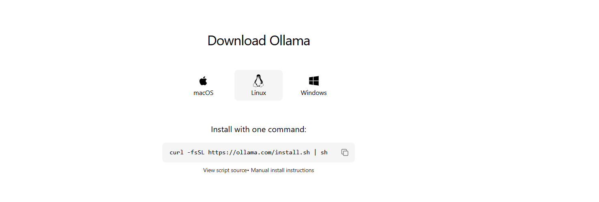

## OLLAMA Expeditions

This folder contains the code for the OLLAMA Expeditions project.

#### Installation

- local installation using either appliation or curl script
- reference: https://ollama.com/download
- 
- check version

```bash
ollama --version
```
- check resources

```bash
ollama ps
```

- test the installation 

```bash
ollama run smollm2:135m
```
ollama help
```bash
ollama help
```


#### Ollama Serve
- ollama serve starts the Ollama server.
- Configure it with environment variables like:
    OLLAMA_DEBUG (enable/disable debugging)
    OLLAMA_HOST (set server host)
    OLLAMA_MAX_QUEUE (set max queued requests)
- For more options, run: ollama serve --help
- Ollama uses Gin (Go) as its API server for LLM inference, serving both CLI and other services.
  
#### Ollama run
- ollama run pulls (downloads) an open model from the Ollama models page, runs it locally, and exposes it via the API provided by ollama serve. This allows you to interact with the model through the API or CLI.
  

- ollama run <model_name> [options]
- ollama run <model_name> --help
```bash
ollama run smollm2:135m --help
```
>>> /show info
  Model
    architecture        llama      
    parameters          134.52M    
    context length      8192       
    embedding length    576        
    quantization        F16        

  Parameters
    stop    "<|im_start|>"    
    stop    "<|im_end|>"      

  System
    You are a helpful AI assistant named SmolLM, trained by Hugging Face    

  License
    Apache License               
    Version 2.0, January 2004    

#### Ollama additional commands

- list models
```bash
ollama list
```
- pull models
```bash
ollama pull <model_name>
```
- remove models
```bash
ollama rm <model_name>
```
- show model info
```bash
ollama show <model_name>
```

#### Ollama create
With the ollama create command, you can create a new variant of an existing open model. For example, you will create a new variant of the smollm2:135m parameter model with a context window of 16K, and the temperature (creativeness) is set to 0.1, which is significantly less creative. To do this, first, you will create a Model file named Modelfile-smollm2-16k in your current folder which contains the config and then create a new model using the command:
```bash
ollama create smollm2:135m-16k-ctx -f Modelfile-smollm2-16k
```

### CLI API RUN

#### Command line executable:

- Install JQ - a lightweight and flexible command-line JSON processor 
- JQ is a command-line JSON processor that allows you to parse, filter, and manipulate JSON data easily. It is often used in shell scripts and command-line operations to work with JSON data.

- To install JQ on Ubuntu, you can use the following command: 
```bash
sudo apt-get install jq 
```

#### Generate endpoint
  - Steps:
      - Endpoint: POST /api/generate
      - Purpose: Generate a response from a selected model.
      - Streaming: Responds as a stream by default; can be    configured for a single response.
      - Parameters:
          - model (string, required): Model name (e.g., smollm2:135m)
          - prompt (string, required): The prompt/question for the model
          - suffix (string, optional): Text to append after the response
          - images (array, optional): List of base64-encoded images (for multimodal models)
      - The command uses curl to send a POST request to the API endpoint with the specified parameters.
      - 
        ```bash
          curl http://localhost:11434/api/generate -d '{
          "model": "smollm2:135m",
          "prompt": "Why is the sky blue? Give the shortest answer possible in under 20 words",
          "stream": false
          }' | jq .
        ```
      - 
        ```bash
          curl http://localhost:11434/api/generate -d '{
          "model": "smollm2:135m",
          "prompt": "Why is the sky blue? Give the shortest answer possible in under 20 words",
          "stream": false
          }' | jq '.["response"]' 
        ```
#### Chat endpoint:
The chat endpoint available at /api/chat, which also works with POST, is similar to the generate API. It generates the next message in a chat with a selected model. It is a streaming endpoint that will have a series of responses.

```bash
curl http://localhost:11434/api/chat -d '{
  "model": "smollm2:135m",
  "stream":false,
  "messages": [
    {
      "role": "user",
      "content": "Why is the sky blue? Give the shortest answer possible in under 20 words"
    }
  ]
}' | jq .
```
```bash
curl http://localhost:11434/api/chat -d '{
  "model": "smollm2:135m",
  "stream":false,
  "messages": [
    {
      "role": "user",
      "content": "Why is the sky blue? Give the shortest answer possible in under 20 words"
    }
  ]
}' | jq '.["message"]["content"]'
```

#### list
To list the local models available, you can call the /api/tags endpoint, which works with a GET request. This endpoint lists models available locally that you can send as the model name parameter in the generate and chat endpoints

```bash
curl http://localhost:11434/api/tags | jq .
```
For more references: [text](https://github.com/ollama/ollama/blob/main/docs/api.md)

### PYTHON API RUN
- Refer to the module `ollama_python_exp.py` for the Python API implementation.
- Also refer to module `ollama_python_exp2.py` for the Python API implementation with a different approach
- [text](https://github.com/ollama/ollama-python)