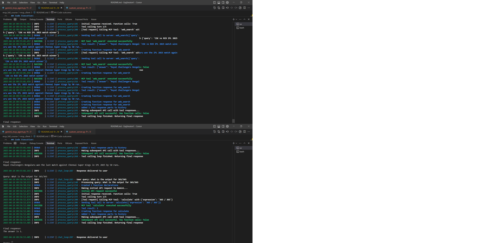

## MCP Working Methology

### MCP Server and MCP Client


### MCP Server


### Workflow

- `Initialization`: When a Host application starts it creates N MCP Clients, which exchange information about capabilities and protocol versions via a handshake.
- `Discovery`: Clients requests what capabilities (Tools, Resources, Prompts) the server offers. The Server responds with a list and descriptions.
- `Context Provision`: The Host application can now make resources and prompts available to the user or parses the tools into a LLM compatible format, e.g. JSON Function calling
- `Invocation`: If the LLM determines it needs to use a Tool (e.g., based on the user's request like "What are the open issues in the 'X' repo?"), the Host directs the Client to send an invocation request to the appropriate Server.
- `Execution`: The Server receives the request (e.g., fetch_github_issues with repo 'X'), executes the underlying logic (calls the GitHub API), and gets the result.
- `Response`: The Server sends the result back to the Client.
- `Completion`: The Client relays the result to the Host, which incorporates it into the LLM's context, allowing the LLM to generate a final response for the user based on the fresh, external information.

### References
<https://dhnanjay.medium.com/the-easiest-way-to-understand-model-context-protocol-mcp-with-code-15fe3b302205>

<https://www.philschmid.de/mcp-example-llama>

<https://aiengineering.academy/Agents/MCP/CreateMCPServe/>

<https://www.philschmid.de/mcp-introduction>

## Code Execution

```bash
uv run gemini_mcp_agent.py C:/workspace/EagSession1/mcp_full_course/mcp_server/custom_server.py
```

## Code outcome

original image:


Predicted image:


## Code Explanation

### Core Components

1. **MCP Client Setup**

```python
class MCPClient:
    def __init__(self):
        self.session = None
        self.exit_stack = AsyncExitStack()
        self.genai_client = genai.Client(api_key=api_key)
        self.model = "gemini-2.0-flash"
```

- Creates client instance
- Sets up Gemini AI connection
- Prepares for server communication

2. **Server Connection**

```python
async def connect_to_server(self, server_script_path: str):
    # Connect to server
    stdio_transport = await self.exit_stack.enter_async_context(stdio_client(server_params))
    self.session = await self.exit_stack.enter_async_context(ClientSession(read, write))
    # Get available tools
    tool_list = await self.session.list_tools()
```

- Establishes connection with MCP server
- Gets list of available tools

3. **Query Processing**

```python
async def process_query(self, query: str):
    # Send query to Gemini
    response = await self.genai_client.aio.models.generate_content(...)
    
    # Process tool calls if needed
    while response.function_calls:
        # Execute tools
        tool_result = await self.session.call_tool(tool_name, args)
        # Get final response
        response = await self.genai_client.aio.models.generate_content(...)
```

- Processes user questions
- Uses tools when needed
- Returns final answers

### Main Process Flow

1. **Startup**
   - Load environment variables
   - Test Gemini API key
   - Connect to MCP server
   - Get available tools

2. **Query Handling**
   - User enters question
   - Gemini AI processes query
   - Determines if tools needed
   - Executes required tools
   - Returns formatted response

3. **Tool Execution**
   - `web_search`: Searches internet
   - `calculate`: Performs math operations

### Available Tools

1. **Web Search**

```python
@mcp.tool()
def web_search(query: str) -> str:
    """Search the web for the given query."""
    return search_response
```

2. **Calculator**

```python
@mcp.tool()
def calculate(expression: str) -> str:
    """Perform basic mathematical calculations."""
    return result
```

### Running the Code

```bash
uv run gemini_mcp_agent.py C:/workspace/EagSession1/mcp_full_course/mcp_server/custom_server.py
```

### Example Usage

Query: Calculate 2 + 2
Response: The result is 4

Query: What is the weather in London?
Response: [Uses web_search tool to find current weather]

### Error Handling

- Validates API key
- Checks server connection
- Handles tool execution errors
- Provides error messages to user

This implementation creates a bridge between user queries and powerful tools, using Gemini AI to understand and process requests effectively.
