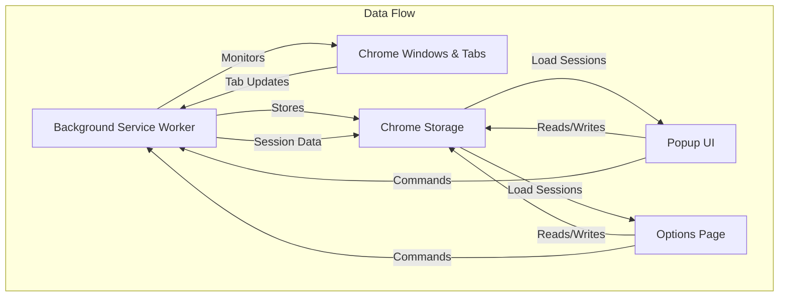
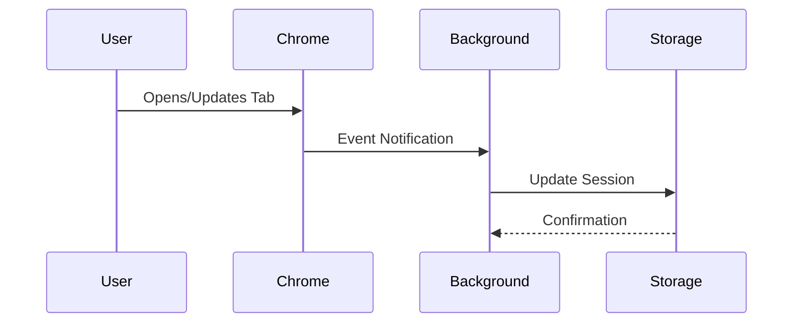
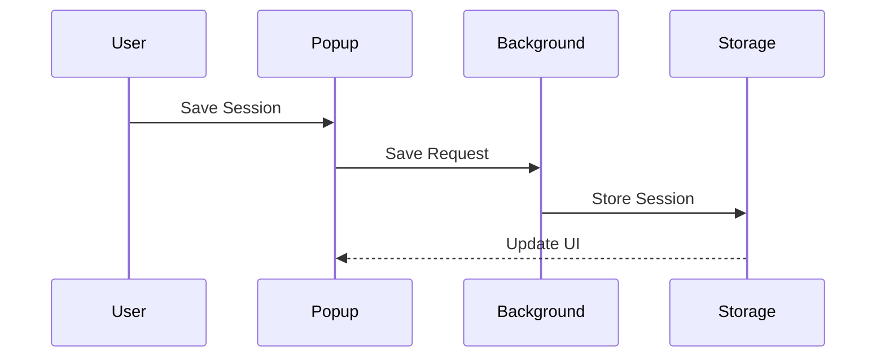

# Tab Session Manager Chrome Extension

A powerful Chrome extension for managing browser sessions, similar to tabmanager.io. This extension allows you to save, organize, and restore your browser windows and tabs.

## Features

- Track URLs by windows and tabs
- Daily session recording
- Save and overwrite sessions
- Restore sessions by windows
- Modern and intuitive user interface
- Session management through popup and options page

## Installation

1. Open Chrome and navigate to `chrome://extensions/`
2. Enable "Developer mode" in the top right corner
3. Click "Load unpacked" and select the extension directory

## Architecture Overview



## Code Structure

### 1. Background Service Worker (`background.js`)

The heart of the extension, responsible for tracking and managing browser sessions.

```javascript
class SessionManager {
  constructor() {
    this.currentSession = {
      date: /* current date */,
      windows: new Map()  // Stores window and tab data
    };
  }
}
```

Key components:
- **Event Listeners**: Tracks tab and window changes
  - `onUpdated`: Captures tab URL and title changes
  - `onCreated`: Records new windows and tabs
  - `onRemoved`: Handles window and tab closures
- **Session Management**:
  - `updateTab()`: Updates tab information in storage
  - `saveSession()`: Persists session data to Chrome storage
  - `restoreSession()`: Recreates saved windows and tabs

### 2. Popup Interface (`popup.js`)

Quick access interface for common actions.

```javascript
// Event Flow:
1. User clicks extension icon
2. loadSessions() fetches saved sessions
3. createSessionElement() renders session cards
4. User can:
   - Save current session
   - Restore previous session
   - Access options page
```

### 3. Options Page (`options.js`)

Full session management interface.

```javascript
// Features:
1. Comprehensive session listing
2. Session statistics
3. Delete functionality
4. Detailed session information
```

## Data Flow

1. **Tab/Window Monitoring**


2. **Session Management**


## Storage Structure

Sessions are stored in Chrome's local storage with the following format:

```javascript
{
  "session_[name]_[date]": {
    name: string,
    date: string,
    windows: [{
      windowId: number,
      tabs: [{
        url: string,
        title: string,
        favicon: string,
        lastAccessed: string
      }]
    }]
  }
}
```

## Event Handling

1. **Tab Updates**
   - Triggered when tab content changes
   - Updates session storage with new tab info
   - Maintains tab history within window context

2. **Window Management**
   - Tracks window creation/removal
   - Groups tabs by window ID
   - Maintains window hierarchy

3. **Session Operations**
   - Save: Captures current browser state
   - Restore: Recreates saved browser state
   - Delete: Removes saved sessions

## Development Workflow

1. **Making Changes**
   ```
   1. Modify source files
   2. Reload extension in chrome://extensions
   3. Test changes in new window
   ```

2. **Debugging**
   - Use Chrome DevTools for background script
   - Check Storage tab for data persistence
   - Monitor Console for errors/logs

## Required Permissions

- `tabs`: For accessing and managing browser tabs
- `storage`: For saving session data
- `bookmarks`: For potential bookmark integration
- `sessions`: For managing browser sessions
- `background`: For running the background service worker

## Best Practices

1. **Session Management**
   - Save sessions frequently
   - Use descriptive session names
   - Regular cleanup of old sessions

2. **Performance**
   - Efficient storage usage
   - Minimal DOM operations
   - Event debouncing

3. **Error Handling**
   - Graceful fallbacks
   - User notifications
   - Data validation

## Note

Please ensure you have saved any important work before restoring a session, as it will close all current windows.

## Contributing

1. Fork the repository
2. Create feature branch
3. Commit changes
4. Submit pull request

## Troubleshooting

Common issues and solutions:
1. **Sessions not saving**
   - Check storage permissions
   - Verify background script status
   
2. **Restore fails**
   - Ensure valid session data
   - Check console for errors

3. **UI not updating**
   - Reload extension
   - Clear extension storage
